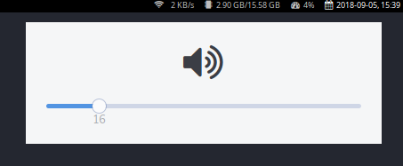

# perspektiv

perspektiv (engl. _spotting scope_) is designed to be a lightweight userland
daemon for graphically reporting system events such as monitor brightness
changes, audio volume changes etc.



I created perspektiv to go hand in hand with
the hotkey setup on my laptop: I wanted something that fits well with the
graphical theme of my system, was lightweight to comfortably have running as a
daemon in the background, and was hackable enough to easily add functionality as
I desired.

However, this means that perspektiv only has stuff that I myself cared about
enough to implement. Currently, that's just the following:
- Monitor brightness with X11/RandR
- Audio volume/mute with ALSA

There's also the `feature/rfkill` branch with a proof-of-concept for an rfkill
module, i.e. for stuff like
- Bluetooth toggle
- Wifi toggle

If there are any additional things that you would like to have, you can easily
implement them yourself! See [the contributing guide](CONTRIBUTING.md) for more
information and hopefully enough documentation to get you started.

perspektiv has been tested on Arch Linux. Your milage might vary on other
distrubutions, although I believe that the core of perspektiv should work
regardless of what platform you're on (as long as you're using linux).

## Installation

perspektiv is written in rust, and to build it, you need a rust compiler. I
realise that this is quite a large requirement and hope to provide some prebuilt
binaries soon^TM. In the meantime, you can easily set up the rust toolchain with
[rustup](https://rustup.rs).

You will also need [Font Awesome 4.7.0](https://fontawesome.com/v4.7.0/) for the
icons to work. This is likely to change in the future as well. Some
distributions have a package for Font Awesome:

| Distro         | Package Name                                                                            |
| -------------- | --------------------------------------------------------------------------------------- |
| Arch Linux     | [ttf-font-awesome-4](https://aur.archlinux.org/packages/ttf-font-awesome-4/) in the AUR |
| Ubuntu, Debian | fonts-font-awesome                                                                      |

If your distro is not listed, it might still have a package that I simply don't
know about. Else, you can just download the [OTF or TTF
file](https://fontawesome.com/v4.7.0/assets/font-awesome-4.7.0.zip) (in the zip
file as `fonts/FontAwesome.otf` or `fonts/FontAwesome-webfont.ttf`) and drop it
into your fonts directory (probably something like `/usr/share/fonts/<TTF or
OTF>`). If you're not sure whether to use the OTF or TTF file, go with the OTF
file.

Once you have that, run:

```shell
git clone https://github.com/henriklaxhuber/perspektiv && cd perspektiv
cargo build --release --features "feature_list"
```

where `feature_list` is a space-separated list of the modules that you would
like to include. You can pick from the following modules:

- `x11_backlight`: Show a popup with the monitor brightness when it is changed
- `alsa_volume`: Show a popup with the current volume or mute status when they
  are changed
- (PoC) `rfkill`: Any rfkill block/unblock event. Support is experimental; you
  need to checkout the branch `feature/rfkill` to build the module.
  
The binary will be created as `./target/release/perspektiv`. Drop this file into
your $PATH somewhere (for a system-wide installation, something like `/bin` will
probaly work well). You must still configure your display manager to start
perspektiv once you log in! Make sure you don't run perspektiv as root.

Note that runnning perspektiv for the first time will create a default
configuration file under `~/.config/perspektiv`.

## Configuration

perspektiv aims to be heavily customizable so that it fits on any system with
any design. This is partially achieved by using GTK to integrate well with the
system theme. But not everything can be done with CSS, and not every GTK theme
works well for perspektiv. This is why you have the [toml
configuration file][0] at your disposal, where you can:
- Set custom CSS files
- Change dimensions such as width, padding, margins, and more
- Change how information is presented

See the [default configuration][0] file for more information on how
to do that.

[0]: default.toml
